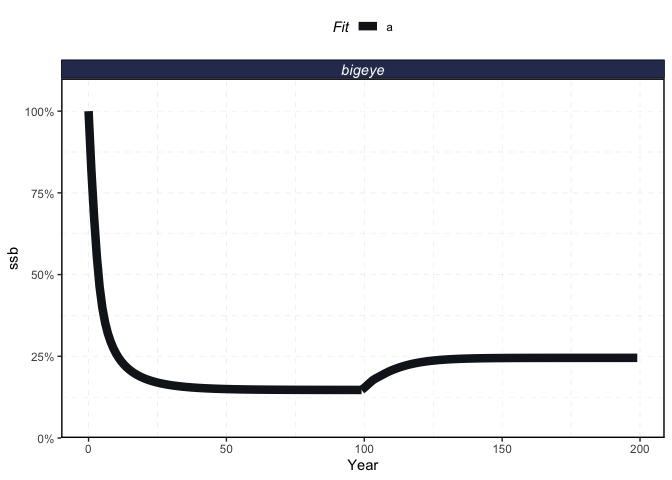
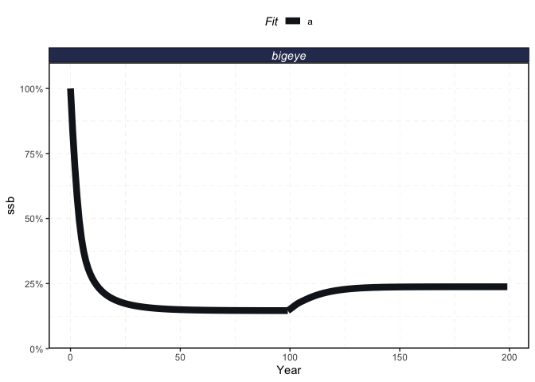
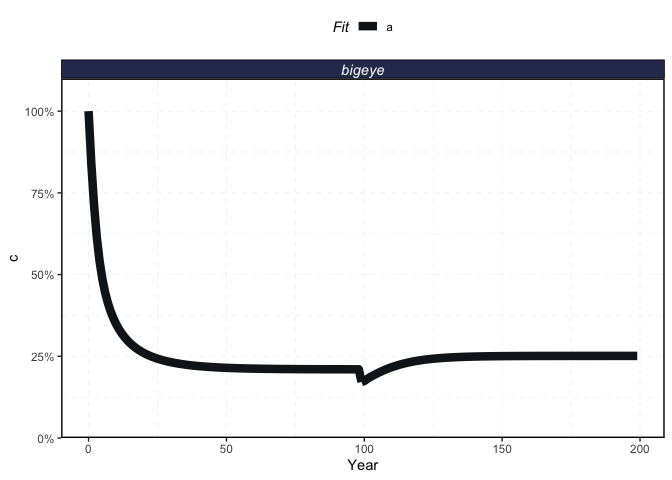
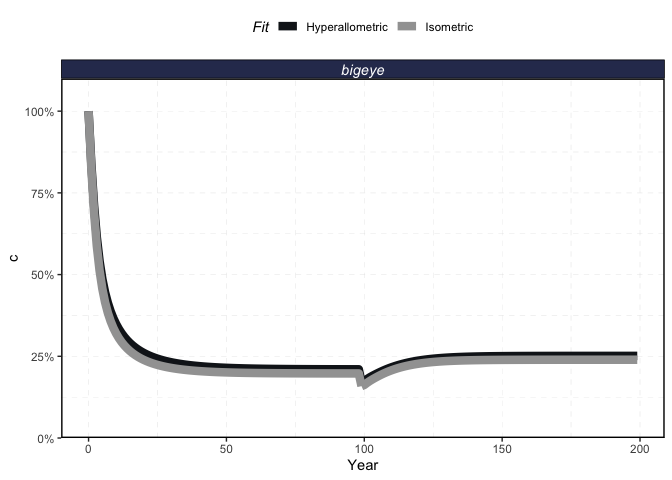

<!-- README.md is generated from README.Rmd. Please edit that file -->

# hyper-mpas

<!-- badges: start -->
<!-- badges: end -->

The goal of hyper-mpas is to expand on the ideas of Marshall et
al. (2021) and explore how hyperallometry affects the outcomes of MPA in
a range of circumstances

Setup

``` r
library(marlin)

library(tidyverse)
#> ── Attaching packages ─────────────────────────────────────── tidyverse 1.3.1 ──
#> ✓ ggplot2 3.3.5     ✓ purrr   0.3.4
#> ✓ tibble  3.1.3     ✓ dplyr   1.0.7
#> ✓ tidyr   1.1.3     ✓ stringr 1.4.0
#> ✓ readr   2.0.1     ✓ forcats 0.5.1
#> ── Conflicts ────────────────────────────────────────── tidyverse_conflicts() ──
#> x dplyr::filter() masks stats::filter()
#> x dplyr::lag()    masks stats::lag()

options(dplyr.summarise.inform = FALSE)

theme_set(marlin::theme_marlin())

resolution <- 20 # resolution is in squared patches, so 20 implies a 20X20 system, i.e. 400 patches 

years <- 200

seasons <- 1

time_step <- 1 / seasons

steps <- years * seasons

adult_movement_sigma <- resolution * 10

recruit_movement_sigma <- resolution * 10

rec_form <- 1

hyper_expo <- 1.75

steepness <- 0.7

fished_depletion <- 0.25

mpa <- expand_grid(x = 1:resolution, y= 1:resolution) %>% 
  mutate(mpa = (1:nrow(.)) < (0.25 * resolution^2))

mpa %>% 
  ggplot(aes(x,y,fill = mpa)) + 
  geom_tile()
```

<!-- -->

``` r
find_refs <- function(log_emult = 0, fauna, fleet, years = 100, use = "opt"){

emult <- exp(log_emult)

tmp_fleet <- fleet

tmp_fleet[[1]]$base_effort <- tmp_fleet[[1]]$base_effort  * emult
  
sim <- simmar(fauna = fauna,
              fleets = tmp_fleet,
              years = years)

eq <- sim[[length(sim)]][[1]]

yield <- sum(eq$c_p_a)

f <- mean((eq$e_p_fl * tmp_fleet[[1]]$metiers[[1]]$catchability)[,1])

refs <- tibble(e_msy = tmp_fleet[[1]]$base_effort, fmsy = f, msy = yield, ssb_msy = sum(eq$ssb_p_a),
               ssb_msy_to_ssb0 = sum(eq$ssb_p_a) / eq$ssb0)

if (use == "opt"){
  out <- -yield
} else {
  
  out <- refs
}

return(out)

}
```

First a simulation with isometry

``` r

iso_critter <- 
  list(
    "bigeye" = create_critter(
      common_name = "bigeye tuna",
      adult_movement = 0,
      adult_movement_sigma = adult_movement_sigma,
      recruit_movement = 0,
      recruit_movement_sigma = recruit_movement_sigma,
      rec_form = rec_form,
      seasons = seasons,
      fished_depletion = fished_depletion,
      resolution = resolution,
      steepness = steepness,
      ssb0 = 1000,
      fec_expo = 1
    )
  )
#> ══  1 queries  ═══════════════
#> 
#> Retrieving data for taxon 'bigeye tuna'
#> ✔  Found:  bigeye+tuna[Common Name]
#> ══  Results  ═════════════════
#> 
#> ● Total: 1 
#> ● Found: 1 
#> ● Not Found: 0

iso_fleet <- list("longline" = create_fleet(
    list("bigeye" = Metier$new(
        critter = iso_critter$bigeye,
        price = 10,
        sel_form = "logistic",
        sel_start = .1,
        sel_delta = .01,
        catchability = 0,
        p_explt = 1
      )
    ),
    base_effort = 10000 * resolution ^ 2
  )
)

a <- Sys.time()

iso_fleet <- tune_fleets(iso_critter, iso_fleet, tune_type = "depletion") 

Sys.time() - a
#> Time difference of 3.539902 secs

ref_opt <- nlminb(log(1e-3), find_refs, fauna = iso_critter, fleet = iso_fleet)

iso_refpoints <- find_refs(ref_opt$par, fauna = iso_critter, fleet = iso_fleet, use = "refs")
 iso_critter$bigeye$plot()
```

<!-- -->

``` r
ref_check <- tibble(emult = seq(1e-3,2, length.out = 20)) %>% 
  mutate(tmp = map(log(emult), ~find_refs(.x, fauna = iso_critter, fleet = iso_fleet, use = "refs")))

ref_check %>% 
  unnest(cols = tmp) %>% 
  ggplot(aes(emult, msy)) + 
  geom_point() + 
  geom_vline(aes(xintercept = exp(ref_opt$par)))
```

<!-- -->

``` r
a <- Sys.time()

iso_sim <- simmar(fauna = iso_critter,
                  fleets = iso_fleet,
                  years = years,
                  mpas = list(locations = mpa,
                              mpa_year = floor(years * .5)))

Sys.time() - a
#> Time difference of 0.6154649 secs


proc_iso_sim <- process_marlin(sim = iso_sim, time_step = time_step, keep_age = FALSE)

plot_marlin(proc_iso_sim)
```

<!-- -->

``` r
plot_marlin(proc_iso_sim, plot_var = "c")
```

<!-- -->

Now, a simulation with hyperallometry

``` r
hyper_critter <- 
  list(
    "bigeye" = create_critter(
      common_name = "bigeye tuna",
      adult_movement = 0,
      adult_movement_sigma = adult_movement_sigma,
      recruit_movement = 0,
      recruit_movement_sigma = recruit_movement_sigma,
      rec_form = rec_form,
      seasons = seasons,
      fished_depletion = fished_depletion,
      resolution = resolution,
      steepness = steepness,
      ssb0 = 1000,
      fec_expo = hyper_expo
    )
  )
#> ══  1 queries  ═══════════════
#> 
#> Retrieving data for taxon 'bigeye tuna'
#> ✔  Found:  bigeye+tuna[Common Name]
#> ══  Results  ═════════════════
#> 
#> ● Total: 1 
#> ● Found: 1 
#> ● Not Found: 0

hyper_critter$bigeye$plot()
```

<!-- -->

``` r
hyper_fleet <- list("longline" = create_fleet(
    list("bigeye" = Metier$new(
        critter = hyper_critter$bigeye,
        price = 10,
        sel_form = "logistic",
        sel_start = .1,
        sel_delta = .01,
        catchability = 0,
        p_explt = 1
      )
    ),
    base_effort = 10000*resolution ^ 2
  )
)

a <- Sys.time()

hyper_fleet <- tune_fleets(hyper_critter, hyper_fleet, tune_type = "depletion") 

Sys.time() - a
#> Time difference of 3.053718 secs

ref_opt <- nlminb(log(1e-3), find_refs, fauna = hyper_critter, fleet = hyper_fleet)

hyper_refpoints <- find_refs(ref_opt$par, fauna = hyper_critter, fleet = hyper_fleet, use = "refs")

ref_check <- tibble(emult = seq(1e-3,2, length.out = 20)) %>% 
  mutate(tmp = map(log(emult), ~find_refs(.x, fauna = hyper_critter, fleet = hyper_fleet, use = "refs")))

ref_check %>% 
  unnest(cols = tmp) %>% 
  ggplot(aes(emult, msy)) + 
  geom_point() + 
  geom_vline(aes(xintercept = exp(ref_opt$par)))
```

<!-- -->

``` r

a <- Sys.time()

hyper_sim <- simmar(fauna = hyper_critter,
                  fleets = hyper_fleet,
                  years = years,
                  mpas = list(locations = mpa,
                              mpa_year = floor(years * .5)))

Sys.time() - a
#> Time difference of 0.606724 secs


proc_hyper_sim <- process_marlin(sim = hyper_sim, time_step = time_step, keep_age = FALSE)

plot_marlin(proc_hyper_sim)
```

<!-- -->

``` r
plot_marlin(proc_hyper_sim, plot_var = "c")
```

<!-- -->

And compare

``` r
iso_refpoints$fmsy / hyper_refpoints$fmsy
#> [1] 1.07985
```

``` r
iso_critter$bigeye$plot()
```

<!-- -->

``` r
hyper_critter$bigeye$plot()
```

<!-- -->

``` r
plot_marlin("Isometric" = proc_iso_sim, "Hyperallometric" = proc_hyper_sim)
```

<!-- -->

``` r
plot_marlin("Isometric" = proc_iso_sim, "Hyperallometric" = proc_hyper_sim, plot_var = "c")
```

<!-- -->

``` r
iso_cmsy <- proc_iso_sim$fleets %>% 
  group_by(step, critter) %>% 
  summarise(catch = sum(catch, na.rm = TRUE)) %>% 
  mutate(cmsy = catch / iso_refpoints$msy) %>% 
  mutate(type = "Isometric")

hyper_cmsy <- proc_hyper_sim$fleets %>% 
  group_by(step, critter) %>% 
  summarise(catch = sum(catch, na.rm = TRUE)) %>% 
  mutate(cmsy = catch / hyper_refpoints$msy) %>% 
    mutate(type = "Hyperallometric")


cmsys <- iso_cmsy %>% 
  bind_rows(hyper_cmsy)


cmsys %>% 
  ggplot(aes(step, cmsy, color = type)) + 
  geom_point()
```

<!-- -->
